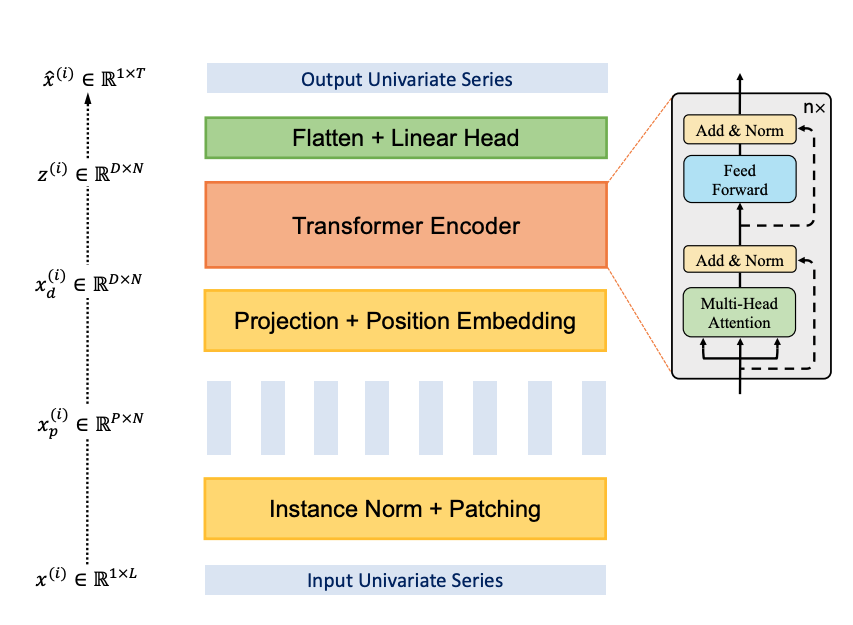

# Transformer-based Classification for Capture-24

> **Status:** Work in progress – model implemented, actively improving F1 score.
---

## Background

Human Activity Classification (HAC) from wearable sensors is a core building block for large-scale physical activity and health monitoring. 

In this project, I focus on **free-living wrist accelerometer data** using the **CAPTURE-24** dataset. CAPTURE-24 contains around 3,883 hours of Axivity AX3 wrist-worn accelerometer data from 151 participants, of which 2,562 hours are densely annotated with activity labels using wearable cameras and sleep diaries. This makes it a much larger and more heterogeneous benchmark than many legacy HAR datasets, and a good testbed for models that need to handle realistic daily-life activities.

On the modeling side, this repo explores a **Transformer-based classifier inspired by PatchTST** (“A Time Series is Worth 64 Words”). PatchTST introduced two key ideas for time series:  
- **Patching** – segmenting long time series into short subseries “patches” that serve as tokens, and  
- **Channel independence** – applying a shared Transformer encoder across univariate channels.  

<figure>
  
  <figcaption><strong>Figure: </strong> Patch TST Architecture Block Diagram</figcaption>
</figure>

In this work, I adapt these ideas to **sequence classification on CAPTURE-24**, evaluating how patch-based Transformers perform on realistic human activity sequences and iteratively improving F1 scores through architecture and training refinements.

### Modelling Progress

| Version / Tag               | F1 (macro) | Cohen’s κ | Pearson-Yule’s φ | Notes                                   |
|-----------------------------|------------|-----------|------------------|-----------------------------------------|
| `Target`†  |    **.576**    |   **.735**    |      **.737**        | CNN+HMM: Best performing model from Capture24 Paper    |
| `Baseline`  |    .375    |   .554    |      .559        | Mixed Channels: L=512, P=16, S=8    |
| `1024 Lookback`  |    .382    |   .554    |      .559        | Mixed Channels: L=1024, P=32, S=8    |
| `Channel Independence`  |    .384    |   .523    |      .523       | Channel Independence: L=1024, P=16, S=8    |
---

## References

[1] Shing Chan, Yuan Hang, Catherine Tong, Aidan Acquah, Abram Schonfeldt, Jonathan Gershuny, Aiden Doherty.  
**CAPTURE-24: A large dataset of wrist-worn activity tracker data collected in the wild for human activity recognition.**  
*Scientific Data*, 11, 1135, 2024. https://doi.org/10.1038/s41597-024-03960-3

[2] Yuqi Nie, Nam H. Nguyen, Phanwadee Sinthong, Jayant Kalagnanam.  
**A Time Series is Worth 64 Words: Long-term Forecasting with Transformers.**  
*ICLR 2023*. arXiv:2211.14730. https://arxiv.org/abs/2211-14730

